# SQL

El sistema de gestión de datos que se usara esta semana es **PostgreSQL**. Consiste en un sistema relacional orientado a objectos y se instalara en el entorno de desarrollo **Laragon**.

## Instrucciones para instalar PostgreSQL

### Instalar Laragon Full para Windows.

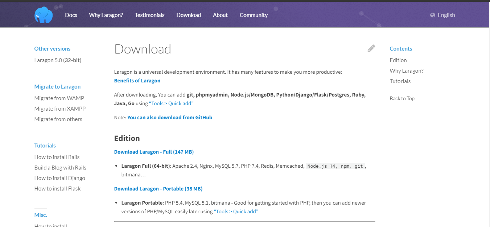

### Verificar si esta activado PostgreSQL

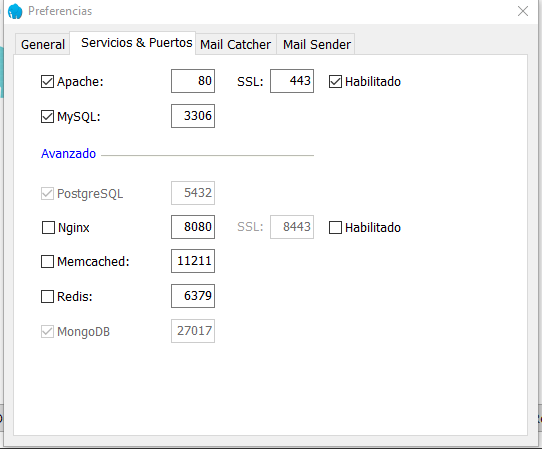

### Descargar los archivos binarios PostgreSQL

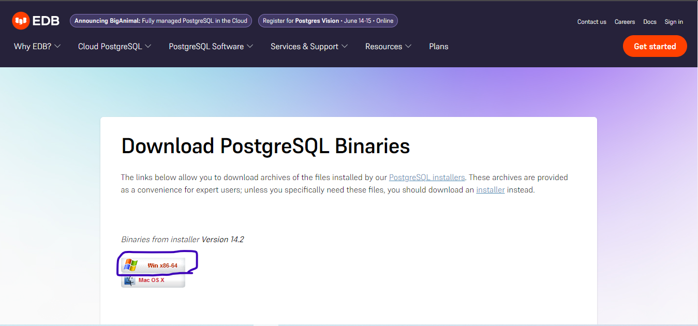

### Crear una nueva carpeta llamado `postgresql` dentro de la carpeta `bin` ubicada en la carpeta `laragon` en el disco duro

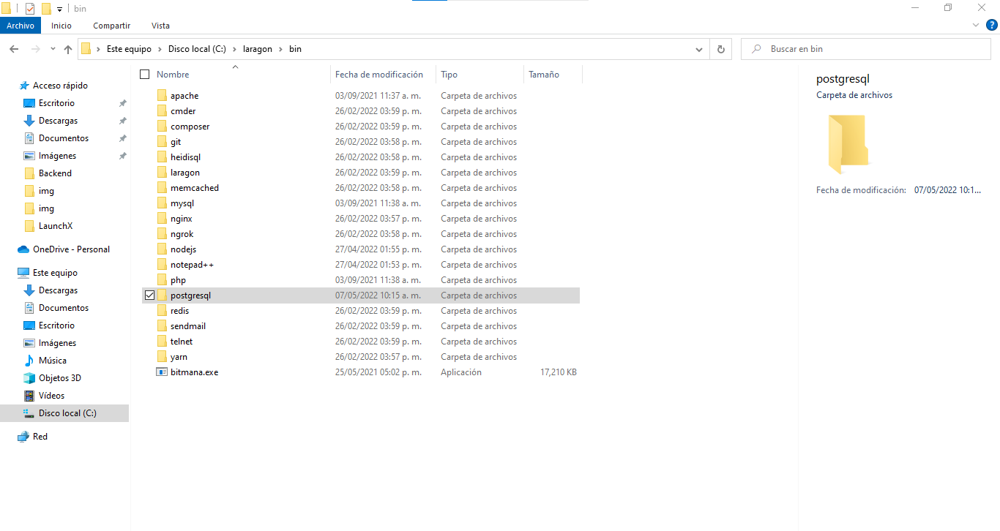

### Extraer la carpeta `pgsql` dentro del archivo rar `postgresql-14.2-2-windows-x64-binaries` a la carpeta `postgresql` y la carpeta extraída cambiar el nombre a `pgsql-14-2-2`

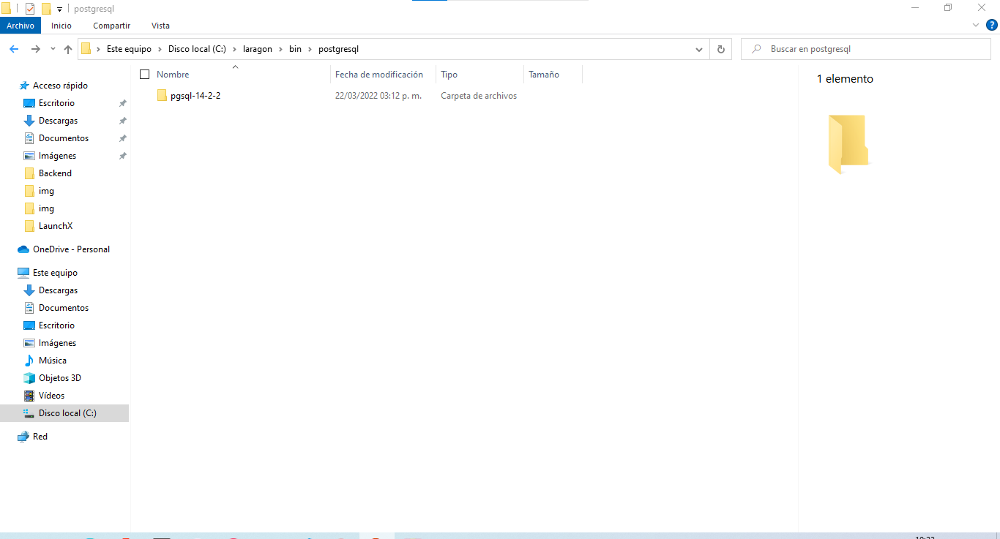

### Reiniciar Laragon

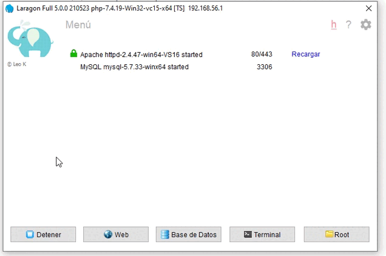

### Configurar contraseña para entrar `pgadmin`

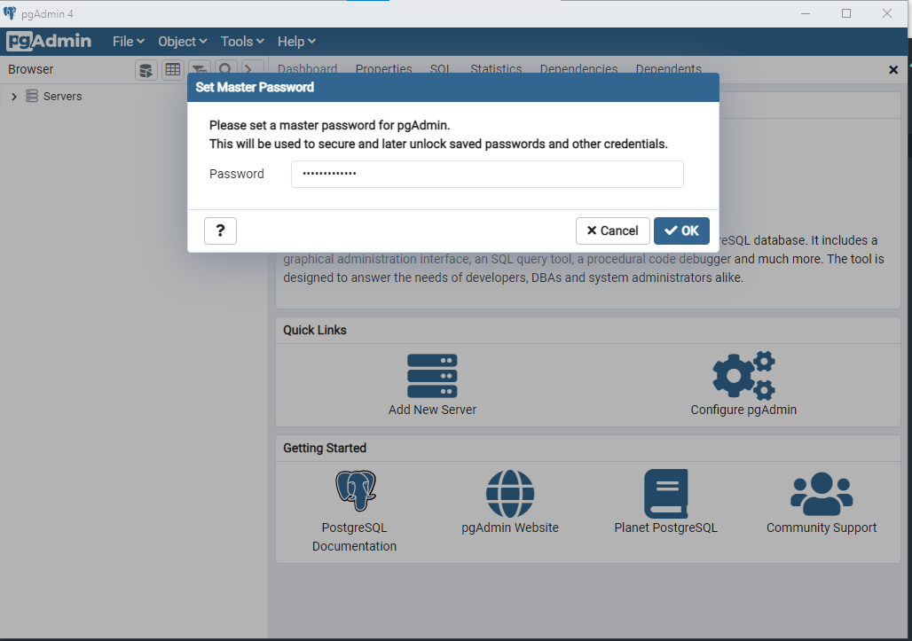

### Crear un nuevo servidor con el nombre `ServerLaragon` con el conexión `localhost`

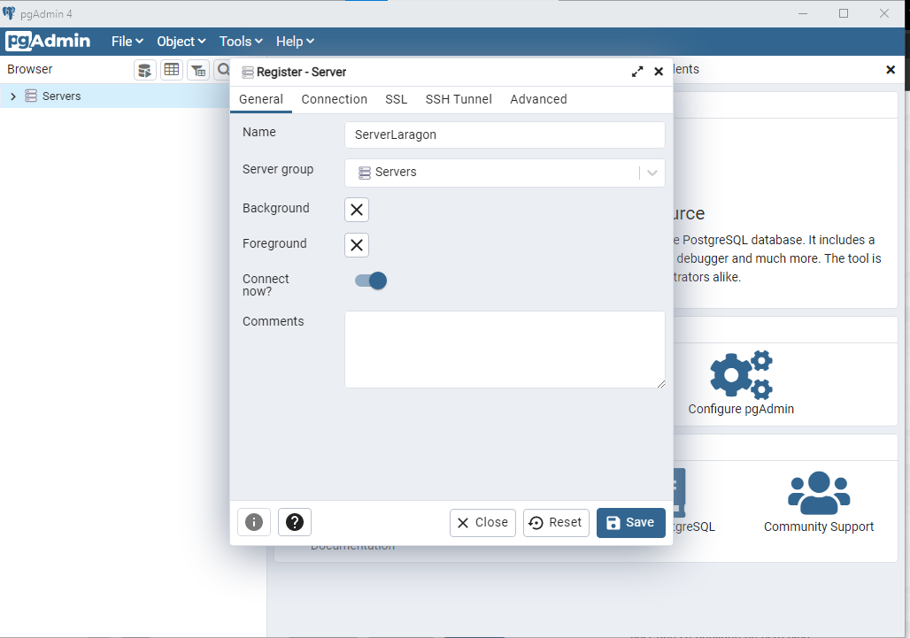

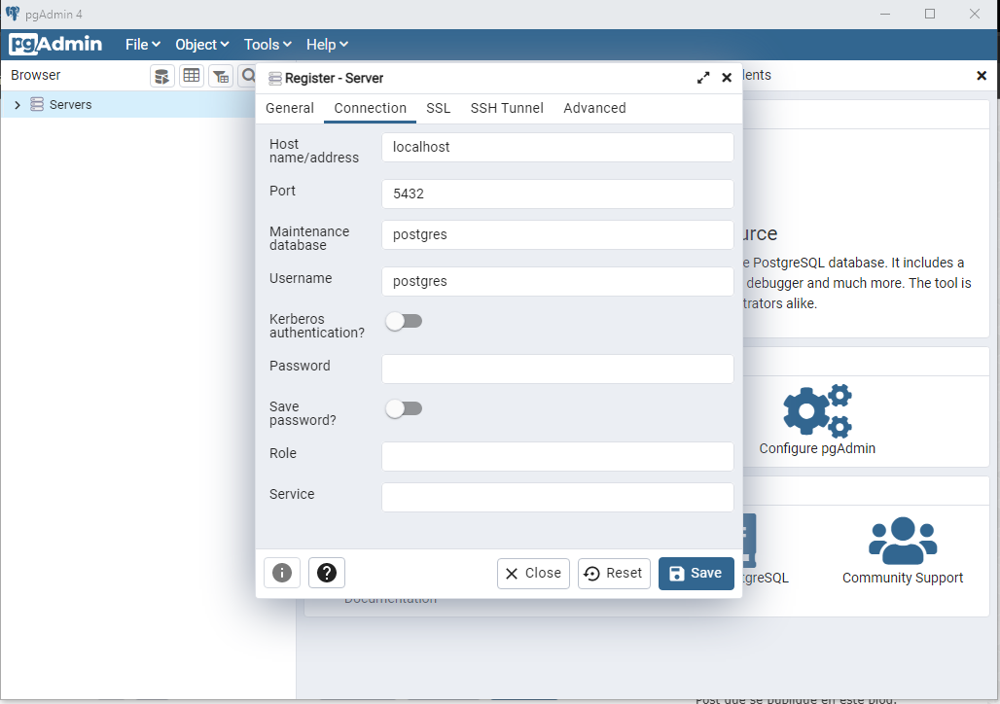

## Ejercicio

### Crear base de datos

1. Entrar al motor de **PostgreSQL** mediante el comando `psql`
2. Crear una base de datos con el nombre **launchx_nodejs** mediante el comando `create database launchx_nodejs;`
3. Seleccionar la base de datos creada mediante el comando `\c launchx_nodejs;`
4. Ver las tablas de la base de datos creada mediante el comando `\dt`
5. Crear una tabla con el nombre `explorers` mediante el comando `CREATE TABLE explorers(id bigserial, username varchar(50));`
6. Ver de nuevo todas las tablas `\dt`

Resultados

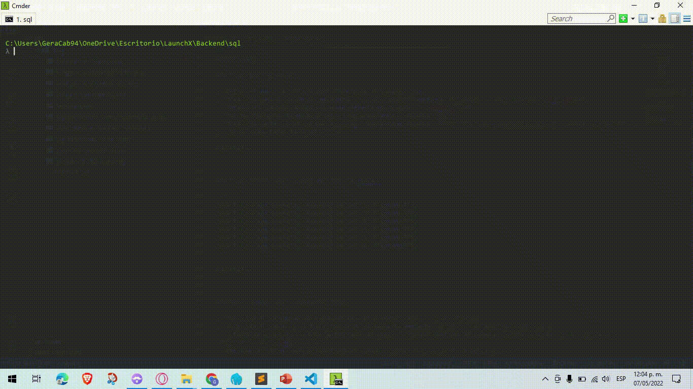

### Crear 6 datos para llenar la tabla `explorers`

```
insert into explorers(id, username) values (1, 'Explorer1');
insert into explorers(id, username) values (2, 'Explorer2');
insert into explorers(id, username) values (3, 'Explorer3');
insert into explorers(id, username) values (4, 'Explorer4');
insert into explorers(id, username) values (5, 'Explorer5');
insert into explorers(id, username) values (6, 'Explorer6');
```

Resultados

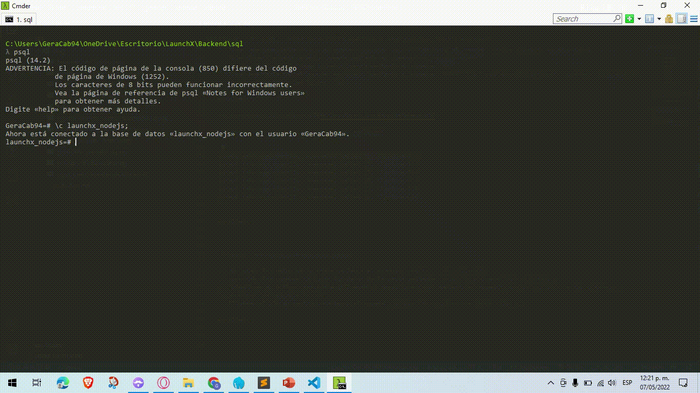

### Usar comandos para manipular tablas

1. Ver todos los datos de la tabla mediante el comando `select * from explorers;`
2. Leer solo los nombres de todos los datos de la tabla mediante `select e.username from explorers e;`
3. Actualizar el ultimo registro modificando el campo `username` mediante el comando `update explorers e set username = 'Explorer 6 Upd' where e.id = 6;`
4. Eliminar el ultimo registro mediante el comando `delete from explorers e where e.id = 6;`

Resultados


